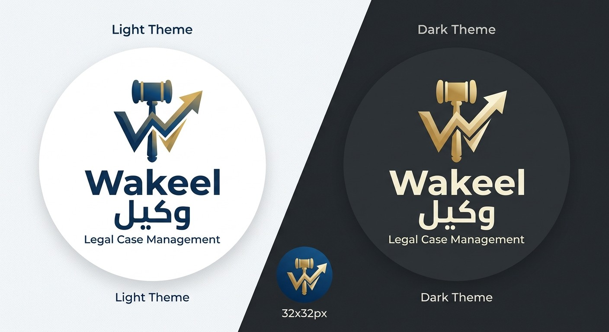

<p align="center">
  
</p>

<h1 align="center">Wakeel · وكيل</h1>

<p align="center"><strong>Legal case management for expert offices</strong> — matters, sessions, letters and minutes, WhatsApp and email, HR and payroll, property management, in Arabic and English.</p>

---

Built with **Laravel 13**, **Filament 5** and **Livewire 4**. Each office runs its **own standalone installation**: its own database, files, branding, settings and outside services (Microsoft 365, Pusher, WhatsApp, cron) — nothing is shared between offices.

## Table of Contents

- [Overview](#overview)
- [Key Features](#key-features)
- [Tech Stack](#tech-stack)
- [System Requirements](#system-requirements)
- [Installation & Setup](#installation--setup)
- [Setting Up an Office](#setting-up-an-office)
- [Running the Application](#running-the-application)
- [Entry Points & Routing](#entry-points--routing)
- [Keyboard Shortcuts](#keyboard-shortcuts)
- [Environment Variables](#environment-variables)
- [Testing](#testing)
- [Project Structure](#project-structure)
- [Releasing a New Version](#releasing-a-new-version)
- [License](#license)

---

## Overview

**Wakeel** is tailored for court-appointed expert offices and legal operations in the UAE. It follows a matter from assignment to final report: parties and experts, sessions and the Outlook calendar, letters and meeting minutes issued as PDF/Word, sending them by email or WhatsApp for signature, fees and collections, requests and approvals — plus the office's own HR, payroll, incentives and (optionally) property leasing.

Arabic is the default language, English the fallback; every screen, document and message works right-to-left.

Two panels, each a module that can be switched on per installation:

| Panel | Path | Module |
|---|---|---|
| **MMS** — Matter Management | `/mms` | Matters, letters, minutes, calendar, communications, HR & payroll, reports |
| **PMS** — Property Management | `/pms` | Properties, units, owners, tenants, quotations, leases, installments |

---

## Key Features

### Matters
- Matters with courts, types (with custom fields), levels, difficulty, sub-matters, fees with VAT and offsets, collection status.
- Parties, representatives, experts and assistants; per-type side names (plaintiff, appellant …).
- Matter requests and approvals (difficulty, distribution date, report reviews, incentives) with in-app and email decisions.
- Live tab counts, attachments, notes and a full activity log.

### Letters & Minutes
- Letter templates with placeholders (`{{matter.reference}}`, `{{recipient.name}}`, `{{company.phone}}` …), letterheads designed on a canvas, signature layouts and custom fonts (Arabic and Latin).
- Issued as **PDF** and **Word**, numbered by a configurable reference format, optionally creating a **Teams meeting** and putting its link in the letter.
- **Meeting minutes**: attendees, questions and answers, autosaved, a live view, finalised as PDF.
- **Send for signature** by email (from an email template) and **WhatsApp** (approved Meta template with the PDF). Signed copies replied on WhatsApp are filed with the matter and in its OneDrive folder; a text reply instead is kept, notified, and answered once with how to send the copy and how to reach the office.

### Communication
- **Email**: per-office mailboxes — **cPanel (SMTP)** or **Microsoft 365** — email templates by purpose, bulk mail campaigns with Excel placeholders, scheduling and live progress.
- **WhatsApp Business Cloud API**: templates, document headers, webhook for replies.
- **Internal chat**: conversations and groups, files and voice notes, reactions, replies, delete-before-seen, online presence.
- **Notifications**: bell, toast, desktop/phone push — each opening exactly what it is about.

### Calendar & OneDrive
- Sessions on a calendar, synced with **Outlook**; events linked to matters by their number.
- A **OneDrive** folder per matter for each assistant, with subfolders and signed minutes.

### HR, Payroll & Incentives
- Employee profiles, salary components, leave requests (email approve/reject links), leave balances, flight tickets, loans and installments, end-of-service gratuity.
- Payroll runs with payslips, WPS/salary authorization and journal vouchers.
- Incentive engine by matter type with extra rules and adjustments.

### Property Management (PMS)
- Owner groups, properties and units, tenants, quotations, leases with installments, condition and print templates.

### Across the system
- **Global search** (Ctrl+K) over matters, requests, parties, events, employees and the main PMS records.
- **Reports**: overdue matters, court workload, quality, monthly, fee aging, VAT, profitability, deductions, assistant performance and incentives.
- **In-app User Guide** — every screen explained step by step with pictures, and who can do each action.
- **Roles & permissions** (Filament Shield), per-screen and per-tab permissions, impersonation, audit log.
- **Performance tracking**: per-screen timings and repeated queries, with a Markdown export.
- **One-click updates** from System Updates, licence check, maintenance mode, installer wizard.
- **Branding**: logos for light and dark backgrounds, favicon, default avatar, interface fonts; company name and contact details used on the legal pages and in every template.
- Public **Privacy Policy** and **Terms of Use** pages (Arabic and English).

---

## Tech Stack

| Component | Technology | Version |
|---|---|---|
| Language | PHP | `^8.5` |
| Framework | Laravel | `^13.0` |
| Admin UI | Filament | `^5.0` |
| Reactive UI | Livewire & Alpine.js | `^4.0` |
| CSS | Tailwind CSS | `^4.0` |
| Bundler | Vite | `^7.0` |
| Documents | mPDF, PhpWord | — |
| Real time | Pusher (or Laravel Reverb) | — |
| Tests | PHPUnit | `^12.0` |
| Code style | Laravel Pint | `^1.24` |
| Static analysis | Larastan / PHPStan | `^3.10` |

---

## System Requirements

- **PHP** `>= 8.5` with `pdo_mysql`, `zip`, `mbstring`, `openssl`, `curl`, `bcmath`, `intl`, `fileinfo`, `gd`; `proc_open` enabled for one-click updates.
- **Composer** `>= 2.2`, **Node.js** `>= 20` with **npm** `>= 10` (to build assets).
- **Database**: MySQL `>= 5.7`, MariaDB `>= 10.4`, or SQLite (tests).
- **git** on the server for one-click updates.
- A web server (Nginx/Apache, Laragon or Valet locally). Shared hosting (cPanel) works; a VPS is faster.

---

## Installation & Setup

### Quick start

```bash
git clone <repository-url> wakeel
cd wakeel
composer run setup
```

Then open the site in a browser — the **installation wizard** (`/install`) takes over: database, company name and logos, the first admin account, the licence and the modules (MMS / PMS).

### Manual

```bash
composer install
npm install
cp .env.example .env
php artisan key:generate
# set DB_* in .env, then:
php artisan migrate
php artisan db:seed --class=ProductionDatabaseSeeder
php artisan storage:link
npm run build
```

---

## Setting Up an Office

Everything an office needs is set from inside the system — no `.env` editing:

1. **System Settings → General**: system and company name, company **phone, WhatsApp and email** (shown on the legal pages and available as `{{company.*}}` everywhere), default language, letter reference format, logos and favicon.
2. **System Settings → Integrations** (super admin only) — each service is **off until filled in**, with a *Connected / Off* badge and a *Turn off* button:

   | Service | What it powers | Without it |
   |---|---|---|
   | **Microsoft 365** (tenant, client ID, secret, calendar mailbox) | OneDrive folders, Outlook calendar, Microsoft 365 mailboxes, Teams meetings | Off; mail can still go through cPanel |
   | **Pusher** (app ID, key, secret, cluster) | Live notifications, chat and counts | Pages check every few seconds instead |
   | **Scheduled tasks** (secret token → link for cron-job.org, every minute) | Queued emails, daily tasks | Emails are sent at once; scheduled tasks don't run |
   | **WhatsApp** (phone number ID, access token) | Sending minutes and messages on WhatsApp | Off |

   Secrets are stored encrypted and never sent back to the page.
3. **Settings → Mail senders**: the office's mailboxes, each **cPanel (SMTP)** or **Microsoft 365**.
4. **Templates**: letterheads, letter templates, email templates (letters / minutes for signature), WhatsApp templates (and the webhook's app secret).
5. **System Settings → Notifications**: who receives new leave requests (empty: whoever can approve leave).

Values in `.env` still work as a fallback for installations set up before these settings existed.

---

## Running the Application

```bash
composer run dev          # PHP server, queue worker and Vite together
```

Or separately: `php artisan serve`, `npm run dev`, `php artisan queue:work`.

On a server, either point a real cron at `php artisan schedule:run` every minute, or create a **cron-job.org** job for the link shown in **System Settings → Integrations → Scheduled tasks**.

---

## Entry Points & Routing

| Path | What |
|---|---|
| `/mms` | Matter Management panel (dashboard, matters, chat, calendar, reports, settings) |
| `/pms` | Property Management panel |
| `/install` | Installation wizard (until installed) |
| `/privacy`, `/terms` | Public Privacy Policy and Terms of Use |
| `/cron/run?token=…` | Web cron trigger (scheduler + queue), for cron-job.org |
| `/webhooks/whatsapp` | Meta WhatsApp webhook (verify token + signed calls) |
| `/leave-requests/{id}/email-action/approve` · `/reject` | Signed one-click leave decisions from the email |
| `/mail/unsubscribe/{token}` | Bulk mail unsubscribe |

---

## Keyboard Shortcuts

| Keys | Action |
|---|---|
| **Ctrl+K** | Global search |
| **Ctrl+S** | Save the form |
| **N** or **Ctrl+Alt+N** | New record on a list (on the dashboard: a new matter) |
| **Ctrl+Alt+U** | System Updates (for those who may update) |

---

## Environment Variables

Most configuration lives in **System Settings**. `.env` holds what the server needs before the database is reachable:

| Variable | Description | Example |
|---|---|---|
| `APP_NAME`, `APP_URL`, `APP_KEY` | Application name, public URL, encryption key | `Wakeel`, `https://office.example.com` |
| `APP_LOCALE` / `APP_FALLBACK_LOCALE` | Default and fallback language | `ar` / `en` |
| `APP_TIMEZONE` | Office timezone | `Asia/Dubai` |
| `DB_*` | Database connection | `mysql` |
| `CACHE_STORE`, `SESSION_DRIVER`, `QUEUE_CONNECTION` | Drivers | `file`, `database`, `database` |
| `MODULE_MMS_ENABLED`, `MODULE_PMS_ENABLED` (and `MODULE_MMS_PAYROLL_ENABLED`, `…_COMMUNICATIONS_ENABLED`, `…_CALENDAR_ENABLED`) | Which panels and modules this installation has | `true` |
| `LICENSE_SERVER_URL` | Licence server (the key is entered in the installer) | — |

Optional fallbacks (prefer **System Settings → Integrations**): `PUSHER_*`, `MICROSOFT_*` / `MICROSOFT_GRAPH_*`, `WHATSAPP_*`, `CRON_TOKEN`.

---

## Testing

PHPUnit 12, against an in-memory SQLite database (the suite refuses to run against anything else).

```bash
php artisan test --compact                                 # everything
php artisan test --compact tests/Feature/GlobalSearchTest.php
php artisan test --compact --filter=test_a_text_sent_back
```

---

## Project Structure

```
wakeel/
├── app/
│   ├── Filament/
│   │   ├── Mms/            # Matter Management panel: resources, pages, actions, widgets
│   │   ├── Pms/            # Property Management panel
│   │   └── Shared/         # Both panels: System Settings, Updates, Performance, User Guide, chat
│   ├── Http/               # Controllers (cron, WhatsApp webhook, prints, decisions) and middleware
│   ├── Livewire/           # Chat widget, installer, notification poller
│   ├── Models/             # Eloquent models
│   ├── Services/           # Letters & minutes, mailers, OneDrive, Outlook, WhatsApp, payroll, updater, licence
│   └── Support/            # Branding, company contact, integrations, guide, permissions
├── config/
├── database/               # Migrations, factories, production seeders
├── docs/images/            # README images
├── lang/                   # ar.json and vendor translations
├── public/guide/           # User Guide screenshots
├── resources/
│   ├── css/                # Tailwind theme
│   ├── guide/              # User Guide content
│   └── views/              # Blade: panels, letters, emails, legal pages
├── routes/
└── tests/                  # Feature and unit tests
```

---

## Releasing a New Version

Installations learn about new versions from the licence server on their regular check-in. Super admins see an **update available** banner and update from **System Settings → System Updates** (or **Ctrl+Alt+U**). The updater checks out the release's git tag, runs `composer install`, migrates, refreshes permissions and rebuilds caches, with the site in maintenance mode.

To publish a release:

1. Rebuild and commit frontend assets if CSS/JS changed: `npm run build`.
2. Commit, tag the commit with a **lightweight** tag and push it — the tag **is** the version:

   ```bash
   git tag v1.8.0
   git push origin main
   git push origin v1.8.0
   ```

3. The **Release** GitHub Action (`.github/workflows/release.yml`) turns the commit messages since the previous tag into release notes, creates the GitHub Release and sends it to the licence server, where it appears as **unpublished**. Review and tick **Published** to offer it to installations.

   The Action needs the repository variable `LICENSE_SERVER_URL` and the secret `RELEASES_API_TOKEN`. Push release tags one at a time.

An installation reports the highest `vX.Y.Z` tag on its checked-out commit; `app_version` in `config/license.php` is only the fallback for an untagged checkout.

---

## License

This software is proprietary and confidential. All rights reserved.
